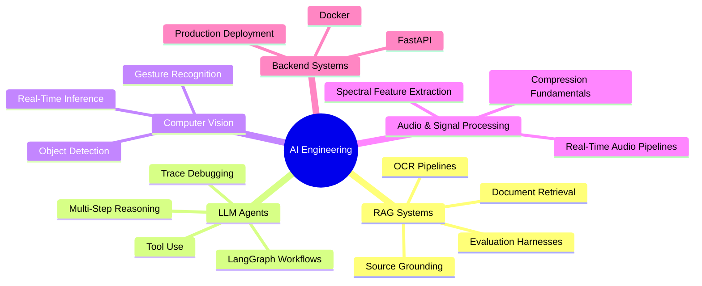

<div align="center">


<br/>

<a href="https://linkedin.com/in/gourav-srinivasalu">
  
</a>
<a href="mailto:gourav.srinivasalu@gmail.com">
  
</a>
<a href="https://careergraph-ai-gourav.streamlit.app/">
  
</a>
<a href="#">
  
</a>

<br/><br/>


</div>

<br/>

## 👋 About Me

I'm a Master's student in **Artificial Intelligence Engineering** at the **University of Passau, Germany**, building AI systems that are practical, explainable, and production-minded — not just demos.

I work at the intersection of:

```
🔎 Retrieval-Augmented Generation      🤖 Agentic AI & Tool-Using LLMs
📄 Document Intelligence & OCR         👁️  Computer Vision & Real-Time Inference
⚙️  Backend APIs for AI Products        📊 Applied ML & Data Systems
```

Previously worked with enterprise data and ML pipelines at **IBM**, and fraud detection systems at **PayPal**, gaining hands-on experience with Python, SQL, production ML, and stakeholder-facing reporting.

## 🚀 Featured Project

<table>
<tr>
<td width="100%">

### 🎯 CareerGraph AI — Recruiter Matching Platform

An AI-powered QR portfolio that turns a static resume into an interactive recruiter experience. Recruiters scan a QR code, paste a target role or JD, and instantly see which projects prove candidate-role fit.

**Highlights:** Role-based project matching · JD match mode · Reviewer snapshot · Lead capture dashboard · Follow-up suggestions

`Python` `Streamlit` `SQLite` `Pandas` `Rule-based Matching`

<a href="https://careergraph-ai-gourav.streamlit.app/"></a>
<a href="https://github.com/GouravJr/careergraph-ai"></a>

</td>
</tr>
</table>

<br/>

## 🛠️ Tech Stack

<div align="center">

**AI / ML / GenAI**


**Programming / Backend / Tools**


**Data / ML Libraries**


</div>

<br/>

## 📂 Project Portfolio

<table>
<tr>
<td width="50%" valign="top">

### 🕵️ Agentic Multi-Document Analysis System

Autonomous AI agent for multi-document reasoning — reads, OCRs, semantically compares, and generates reports across documents. Built for invoice comparison and discrepancy detection.

`LangGraph` `LangChain` `FastAPI` `FAISS` `Tesseract OCR`

[→ View Repo](https://github.com/GouravJr/agentic-doc-analyst)

</td>
<td width="50%" valign="top">

### 📚 OCR-Based RAG Assistant

Bilingual (German/English) document Q&A system. Upload PDFs or scans, ask questions in natural language, get document-grounded answers via OCR + semantic retrieval.

`LangChain` `FAISS` `Sentence Transformers` `Groq` `FastAPI`

[→ View Repo](https://github.com/GouravJr/rag-document-intelligence)

</td>
</tr>
<tr>
<td width="50%" valign="top">

### 🌆 Music-Driven Cityscape Visualization
📄 *Published research prototype*

Real-time audio-reactive visualization inspired by the city of Passau. Extracts RMS, tempo, beat, and spectral centroid features and maps them to synchronized procedural visuals — 55-65 FPS on commodity hardware.

`Python` `Librosa` `SciPy` `Pygame` `Signal Processing`

</td>
<td width="50%" valign="top">

### 🎮 Gesture-Controlled Game System

Real-time body gesture recognition for interactive gaming. MediaPipe Pose landmark extraction with rule-based and ML gesture classification, stabilized with buffering and majority voting.

`OpenCV` `MediaPipe` `scikit-learn` `KNN` `Random Forest`

</td>
</tr>
<tr>
<td width="50%" valign="top">

### 🥽 UXRVT — Unity XR Visualization Toolkit

Unity-based toolkit for immersive 3D data visualization, inspired by D3.js concepts. Supports interactive 3D exploration for XR/AR visual interfaces.

`Unity` `C#` `XR` `Data Visualization`

[→ View Repo](https://github.com/GouravJr/UXRVT-UnityXR-Toolkit)

</td>
<td width="50%" valign="top">

### ✈️ Munich eVTOL Airspace Digital Twin

Deterministic digital twin for a 30-aircraft eVTOL fleet: graph-based routing, corridor congestion management, and safety-critical emergency dispatch logic with a live React dashboard.

`Python` `React` `FastAPI` `Graph Algorithms`

</td>
</tr>
</table>

<br/>

## 🧭 Current Focus



<br/>

## 💡 What I Like Building

<table>
<tr>
<td width="33%" align="center">🤖<br/><b>Reasoning Agents</b><br/><sub>Tools + explainable steps</sub></td>
<td width="33%" align="center">📄<br/><b>RAG Systems</b><br/><sub>Real documents, not demos</sub></td>
<td width="33%" align="center">👁️<br/><b>Vision & Signal</b><br/><sub>Real-time, production-ready</sub></td>
</tr>
</table>

<br/>

## 📫 Let's Connect

<div align="center">

<a href="https://linkedin.com/in/gourav-srinivasalu"></a>
<a href="mailto:gourav.srinivasalu@gmail.com"></a>
<a href="https://careergraph-ai-gourav.streamlit.app/"></a>

<br/><br/>


<i>Building AI systems that are useful, explainable, and production-minded.</i>

</div>
