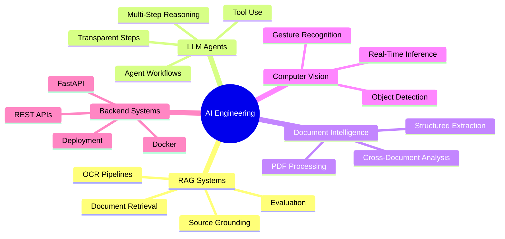

# Hi, I'm Gourav Srinivasalu 👋

### M.Sc. AI Engineering Student · Ex-IBM · AI/ML Systems · RAG · Agentic AI · Computer Vision

I build practical AI systems that connect **machine learning, retrieval, backend APIs, and interactive user experiences**.
Currently focused on **RAG pipelines, LLM agents, document intelligence, computer vision, and production-minded AI engineering**.

---

## About Me

I am a Master's student in **Artificial Intelligence Engineering at the University of Passau, Germany**.

My work focuses on building AI applications that are not only technically interesting, but also **useful, explainable, and usable in real workflows**. I enjoy working at the intersection of AI engineering, backend systems, retrieval, and user-facing applications.

I am especially interested in:

* **Retrieval-Augmented Generation**
* **Agentic AI and tool-using LLM systems**
* **Document intelligence and OCR pipelines**
* **Computer vision and real-time inference**
* **Backend APIs for AI products**
* **Applied machine learning and data-driven systems**

I previously worked with enterprise data and ML workflows at **IBM**, where I gained experience with Python, SQL, dashboards, machine learning models, and reporting automation.

---

## Featured Project

### CareerGraph AI — AI-Powered QR Portfolio & Recruiter Matching Platform

CareerGraph AI turns a normal student portfolio into an intelligent recruiter experience.
Recruiters can open a QR-based profile, select or paste a target role, and instantly see which projects prove candidate-role fit.

**Key features:**

* QR-based recruiter profile
* Role-based project matching
* Job description match mode
* Reviewer snapshot for recruiters and industry partners
* Recruiter lead capture
* Private lead dashboard
* Follow-up message suggestions

**Tech:** Python, Streamlit, SQLite, Pandas, QR generation, JSON-based project data, rule-based matching logic

---

## Tech Stack

### AI / ML / GenAI

  
  
  
  
  
  
  
  

### Programming / Backend / Tools

  

### Data / ML Libraries

  

  
  
  
  

---

## Project Portfolio

<table>
<tr>
<td width="50%">

### CareerGraph AI

AI-powered QR portfolio and recruiter-job matching platform.

* Role-based project matching
* Job description match mode
* Reviewer snapshot and lead dashboard
* Built for recruiter-facing portfolio presentation

**Tech:** Python, Streamlit, SQLite, Pandas

[Live Demo](https://careergraph-ai-gourav.streamlit.app/) · [GitHub](https://github.com/GouravJr/careergraph-ai)

</td>
<td width="50%">

### Agentic Multi-Document Analysis System

Autonomous AI agent for multi-document analysis.

* Uses tool-based reasoning workflows
* Performs document reading, OCR, semantic search, comparison, and report generation
* Designed for invoice comparison, discrepancy detection, and cross-document reasoning

**Tech:** LangGraph, LangChain, FastAPI, Streamlit, FAISS, Tesseract OCR, Groq

[GitHub](https://github.com/GouravJr/agentic-doc-analyst)

</td>
</tr>

<tr>
<td width="50%">

### OCR-Based RAG Assistant

Document Q&A system for German and English documents.

* Upload PDFs and scanned documents
* Ask natural language questions
* Uses OCR and semantic retrieval
* Provides document-grounded answers

**Tech:** LangChain, FAISS, Sentence Transformers, Groq, FastAPI, Streamlit, Tesseract OCR

[GitHub](https://github.com/GouravJr/rag-document-intelligence)

</td>
<td width="50%">

### UXRVT — Unity XR Visualization Toolkit

Unity-based toolkit for immersive 3D data visualization.

* Inspired by D3.js-style visualization concepts
* Supports interactive 3D data exploration
* Built for XR and AR-based visual interfaces

**Tech:** Unity, C#, XR, Data Visualization

[GitHub](https://github.com/GouravJr/UXRVT-UnityXR-Toolkit)

</td>
</tr>

<tr>
<td width="50%">

### Music-Driven Cityscape Visualization

Real-time audio-reactive visual computing project inspired by the city of Passau.

* Extracts audio features such as RMS, tempo, beats, and spectral centroid
* Generates synchronized procedural visual effects
* Includes particles, water ripples, mood-based colors, and animated city elements

**Tech:** Python, Pygame, NumPy, SciPy, Audio Signal Processing

</td>
<td width="50%">

### Gesture-Controlled Game System

Real-time body gesture recognition for interactive gaming.

* Used MediaPipe Pose for skeletal landmark extraction
* Built rule-based and ML-based gesture recognition pipelines
* Applied buffering, majority voting, and smoothing for stable live predictions

**Tech:** Python, OpenCV, MediaPipe, scikit-learn, KNN, Random Forest

</td>
</tr>
</table>

---

## Current Focus

---

## GitHub Snapshot

 

---

## What I Like Building

* AI products that combine **retrieval, reasoning, and clean UX**
* LLM agents that use tools and explain their steps
* RAG systems for real documents, not only demos
* Backend APIs for ML and GenAI applications
* Computer vision systems that work in real time
* Practical projects that can be explained, tested, deployed, and improved

---

## Connect With Me

  
  
  

---

### Building AI systems that are useful, explainable, and production-minded.

