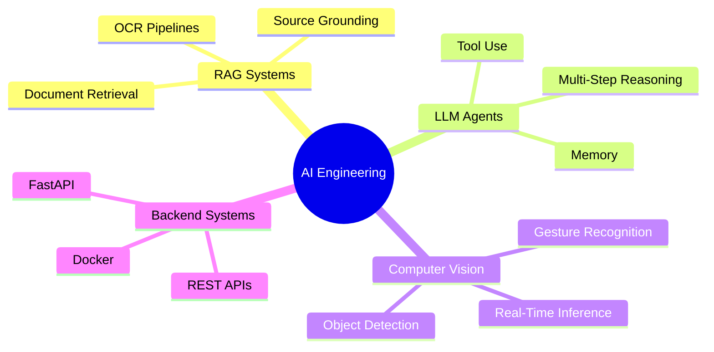

# Hi, I'm Gourav Srinivasalu 👋

### M.Sc. AI Engineering Student · AI/ML Systems · RAG & Agentic AI · Computer Vision

I build practical AI systems that connect **machine learning, retrieval, backend APIs, and interactive user experiences**.  
Currently focused on **RAG pipelines, LLM agents, computer vision, and production-minded AI engineering**.

---

## About Me

I am a Master's student in **Artificial Intelligence Engineering at the University of Passau**, Germany.  
My work is centered around building AI applications that are not only technically interesting, but also useful, explainable, and usable in real workflows.

I enjoy working at the intersection of:

- **Retrieval-Augmented Generation**
- **Agentic AI systems**
- **Computer Vision**
- **Backend APIs**
- **Applied Machine Learning**
- **Interactive AI applications**

Right now, I am exploring how LLM agents can use tools, retrieve documents, reason across multiple sources, and support users through transparent step-by-step workflows.

---

## Tech Stack

### AI / ML / GenAI

  
  
  
  
  
  
  

### Programming & Backend

  

### Data / ML Libraries

  

  
  
  
  

---

## Featured Projects

<table>
<tr>
<td width="50%">

### Agentic Document Analyst

Autonomous AI agent for multi-document analysis.

- Uses LangGraph-style agent workflows
- Performs document reading, OCR, semantic search, comparison, and report generation
- Designed for tasks like invoice comparison, hidden cost detection, and cross-document reasoning

**Tech:** LangGraph, LangChain, FastAPI, Streamlit, FAISS, Tesseract OCR, Groq

</td>
<td width="50%">

### RAG Document Intelligence

Document Q&A system for German and English documents.

- Upload documents and ask natural language questions
- Uses OCR + semantic retrieval
- Provides grounded answers with document context
- Built as a practical RAG pipeline beyond notebook experiments

**Tech:** LangChain, FAISS, Sentence Transformers, Groq, FastAPI, Streamlit

</td>
</tr>

<tr>
<td width="50%">

### Gesture-Controlled Game System

Real-time body gesture recognition for interactive gaming.

- Used MediaPipe Pose for skeletal landmark extraction
- Built rule-based and ML-based gesture recognition pipelines
- Applied buffering, majority voting, and smoothing for stable live predictions

**Tech:** Python, OpenCV, MediaPipe, scikit-learn, KNN, Random Forest

</td>
<td width="50%">

### Fridge-to-Recipe AI Assistant

Applied AI lab project for ingredient detection and recipe assistance.

- Uses food/fridge image datasets for object detection
- Focuses on ingredient recognition and recipe recommendation flow
- Web interface planned after core data processing and modeling

**Tech:** Python, Computer Vision, Roboflow Dataset, Object Detection

</td>
</tr>
</table>

---

## Current Focus

---

## GitHub Snapshot

 

---

## What I Like Building

- AI systems that combine **retrieval, reasoning, and clean UX**
- Backend APIs for ML and GenAI applications
- Computer vision systems that work in real time
- Practical projects that can be explained clearly, tested, and improved

---

## Connect With Me

  
  

---

### Building AI systems that are useful, explainable, and production-minded.

